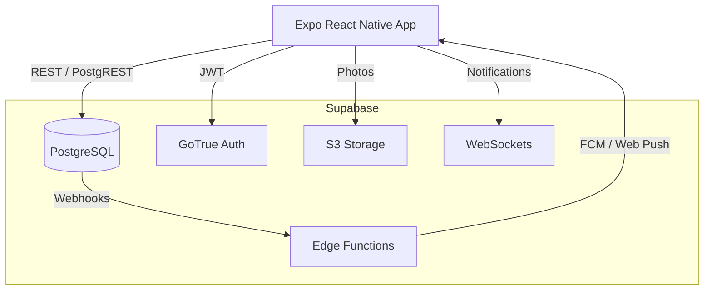

# TheBucketList 🌍 


Your life, your bucket list. A social platform to track, share, and achieve your life goals.

## 🚀 Quick Start

### Prerequisites
- Node.js 20+
- Docker & Docker Compose (for local Supabase)
- Expo CLI

### Installation

1. **Clone & Install**
   ```bash
   git clone https://github.com/julia8873/TheBucketList.git
   cd TheBucketList
   npm install
   ```

2. **Start Backend (Supabase)**
   ```bash
   make up
   make reset-db
   ```

3. **Environment Variables**
   Copy `.env.example` to `.env.development` and populate the values (the Makefile script will give you the local Supabase URLs).

4. **Run the App**
   ```bash
   make web
   # or
   make android
   ```

## 🏗 Architecture



## ✨ Features
- **Offline First**: Offline queue with Zustand + NetInfo, automatic sync on reconnect.
- **Quota Management**: 50MB user storage quota enforced at the Database level via triggers.
- **Social**: Realtime notifications, emoji reactions, comments, and following/followers.
- **PWA**: Fully functional as a Progressive Web App, installable, and optimized for SEO.
- **Performance**: High frame rates via `@shopify/flash-list` and Reanimated.

## 🧪 Testing (Maestro)
End-to-End tests are run using Maestro.
```bash
maestro test tests/e2e/core_flow.yaml
```

## 📜 License
MIT License.
