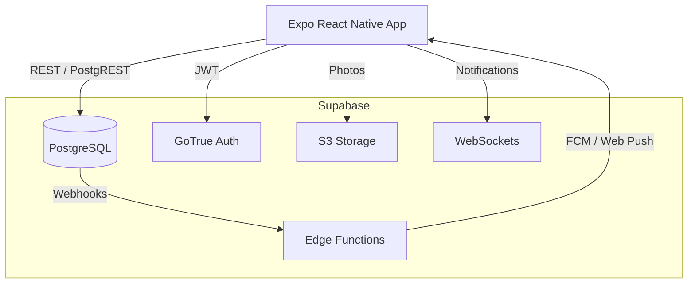

# TheBucketList 🌍


Tu vida, tu lista de deseos. Una plataforma social para registrar, compartir y cumplir tus metas vitales.

## 🚀 Instalación desde cero

### 1. Requisitos previos

| Herramienta | Versión | Para qué |
|---|---|---|
| Node.js | 20 LTS (≥ 20) | Todo el monorepo |
| npm | el que trae Node 20 | Gestor de paquetes (workspaces) |
| Git | cualquiera | Clonar el repo |
| Docker Desktop | ≥ 4.30 (backend WSL2 en Windows) | Supabase local |
| Android Studio | Hedgehog o superior | SDK de Android + emulador (AVD) |
| JDK 17 | 17 (el JBR de Android Studio vale) | Compilar con Gradle |

Variables de entorno del sistema para Android (Windows):

- `ANDROID_HOME` = `C:\Users\<tu-usuario>\AppData\Local\Android\Sdk`
- Añade a `Path`: `%ANDROID_HOME%\platform-tools`

> **Terminal en Windows:** usa **PowerShell** o **WSL2**. En **Git Bash** las rutas con `\` se rompen
> (`node_modules\paquete` se interpreta mal); allí usa siempre `/`.

### 2. Clonar (fuera de OneDrive)

Clona el proyecto en una carpeta **que no esté sincronizada** con OneDrive/Dropbox, por ejemplo `C:\dev`.
Estos servicios bloquean archivos mientras npm los escribe y pueden dejar `node_modules` a medias
(paquetes sin `src/`, errores `Unable to resolve ...`).

```bash
git clone https://github.com/julia8873/TheBucketList.git
cd TheBucketList
```

### 3. Instalar dependencias (siempre desde la raíz)

```bash
npm ci
```

- Ejecútalo **en la raíz del repo**, nunca dentro de `apps/mobile`. Es un monorepo con workspaces y las
  dependencias se instalan (hoisting) en el `node_modules` de la raíz.
- Usa `npm ci` en lugar de `npm install`: instala exactamente lo que dice `package-lock.json`, borra
  `node_modules` antes y falla si algo sale mal en vez de dejar una instalación incompleta.
- Cierra Metro, VS Code y cualquier terminal que use `node_modules` antes de lanzarlo (evita `EBUSY`/`EPERM`).
- No borres ni regeneres `package-lock.json` sin motivo.

Comprueba que las versiones son compatibles con Expo SDK 52:

```bash
cd apps/mobile
npx expo install --check
cd ../..
```

### 4. Variables de entorno

```bash
cp .env.example .env
cp .env.example apps/mobile/.env
```

- `apps/mobile/.env` es el que lee Expo al arrancar Metro desde `apps/mobile`.
- `.env` en la raíz lo usan Docker Compose y el `Makefile`.
- Para desarrollo local los valores de Supabase por defecto ya valen. Google OAuth, Firebase, VAPID, etc.
  solo son necesarios si usas esas funciones (ver `docs/SETUP.md`).
- Los archivos `.env*` están en `.gitignore`; **nunca** los subas (solo `.env.example`).

### 5. Backend local (Supabase)

Con Docker Desktop abierto:

```bash
npx supabase start
npx supabase db reset      # aplica migraciones + seed
```

O con Make (WSL2 / Git Bash con `make` instalado): `make up` y `make reset-db`.

Servicios: API `http://127.0.0.1:54321`, Studio `http://localhost:54323`, correos de prueba (Inbucket) `http://localhost:54324`.

### 6. Emulador Android

1. Android Studio → **Device Manager** → **Create Device** → *Pixel 8*.
2. Imagen de sistema **API 35** (x86_64) → Finish.
3. Arranca el emulador (▶) antes de lanzar la app.

### 7. Ejecutar la app

**Primera vez** (compila el *dev client* nativo e instala la APK en el emulador; tarda unos minutos y
Gradle descarga ~1 GB):

```bash
cd apps/mobile
npx expo run:android
```

**Siguientes veces** (solo Metro, con la caché limpia si hubo cambios de dependencias):

```bash
cd apps/mobile
npx expo start -c
# pulsa "a" para abrir en Android
```

Versión web/PWA: `cd apps/mobile && npx expo start --web` (o `make web` para la versión servida con Docker).

> Hay que volver a ejecutar `npx expo run:android` cuando cambien dependencias nativas, plugins de `app.json`
> o la versión de Expo.

## 🛠 Solución de problemas

| Síntoma | Causa probable | Solución |
|---|---|---|
| `Unable to resolve "<paquete>"` y el paquete aparece en `node_modules` pero sin carpeta `src/` | Instalación truncada (OneDrive, antivirus, corte de red) | Borra `node_modules` y repite `npm ci` desde la raíz |
| `Unable to resolve` tras instalar | Caché de Metro | `npx expo start -c` |
| `dir node_modulesxxx: No such file` en Git Bash | `\` se interpreta como escape | Usa `/` o PowerShell |
| Error nativo de `RNGestureHandler`/`Reanimated` al abrir la app | La APK instalada es anterior a la dependencia | `cd apps/mobile && npx expo run:android` |
| Versiones desalineadas con Expo | Paquete actualizado a mano | `npx expo install --check` (y `--fix` si procede) |
| Cambios en `app.json` / plugins no se aplican | La carpeta `android/` generada está desfasada | `cd apps/mobile && npx expo prebuild --platform android --clean` |
| `EBUSY` / `EPERM` al instalar | Archivos bloqueados | Cierra Metro/VS Code, pausa OneDrive, repite `npm ci` |

Reinstalación limpia completa (Git Bash / WSL):

```bash
rm -rf node_modules apps/*/node_modules packages/*/node_modules
npm ci
```

En PowerShell:

```powershell
Remove-Item -Recurse -Force node_modules, apps\mobile\node_modules, apps\web\node_modules, packages\shared\node_modules, packages\ui\node_modules -ErrorAction SilentlyContinue
npm ci
```

## 🏗 Arquitectura



Monorepo (npm workspaces): `apps/mobile` (Expo), `apps/web`, `packages/shared`, `packages/ui`, `supabase/`, `infra/`.

## ✨ Características

- **Offline First**: cola offline con Zustand + NetInfo, sincronización automática al reconectar.
- **Gestión de cuota**: 50 MB de almacenamiento por usuario, aplicado en la base de datos mediante triggers.
- **Social**: notificaciones en tiempo real, reacciones con emoji, comentarios y seguidores.
- **PWA**: funciona como Progressive Web App, instalable y optimizada para SEO.
- **Rendimiento**: listas fluidas con `@shopify/flash-list` y Reanimated.

## 🧪 Tests

```bash
npm run lint
npm run typecheck
npm run test
```

Tests end-to-end con Maestro:

```bash
maestro test tests/e2e/core_flow.yaml
```

## 📚 Más documentación

- `docs/SETUP.md` — Firebase, Google OAuth, Brevo SMTP, Supabase en producción.
- `docs/RUNBOOK.md`, `docs/DECISIONS.md`, `docs/COSTS.md`.

## 📜 Licencia

MIT License.